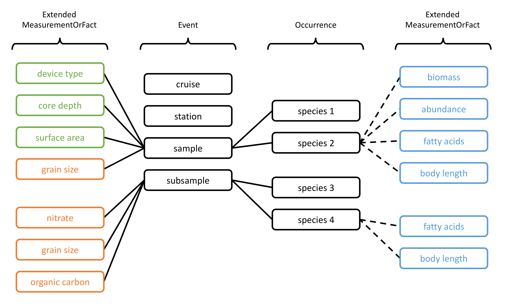

## The IPT at OBIS

- 36 IPTs in the network
- 15 IPTs managed by EurOBIS
- all data flows through IPT with just a few exceptions (standalone Darwin Core Archives)
- various modes of operation: file based, database connections, data directory generation

---

## Data model

- detailed and machine readable sampling methodology, quantitative data, and environmental parameters are a primary focus for OBIS  &rarr; facilitate analyses across datasets, including calculation of Essential Ocean Variables (EOV) data products
- ExtendedMeasurementsOrFacts extension: pragmatic solution to the star schema limitation, but not very intuitive
- Frictionless Tabular Data Packages

---

## Streaming data

- increasing data volume and velocity from autonomous monitoring platforms and citizen science
- incremental / delta updates, `git` for data?

 Image: Julie Barrios

 Image: HIMIOFoTs

---

## Data validation

- data providers and nodes use R packages (`obistools` and others) and online services (LifeWatch, EMODnet) for quality control
- OBIS performs quality control on data ingestion, data quality issues are displayed on our dataset pages but are often not acted upon
- data validation at the IPT level would be very helpful
  - `whip` specifications
  - Frictionless Data Table Schema
  - Frictionless Data `validate` module supports custom checks in addition to predefined checks

---

## IPT and resource registration

- registration of IPTs and datasets in OBIS is a manual process
- how to solve?
  - support multiple registry endpoints?
  - connect installations and resources to networks in the GBIF registry from the IPT

---

## Usability issues

- step by step (wizard) interface for novice users
- wider EML support for expert users, e.g. more detailed geographic coverage with multiple polygons
- manage people and keyword sets at the IPT level
- import contact details from ORCID

---

## Software architecture

- see GeoNode's modular design using core and contributed Django apps
- plugins for input and output of domain specific file formats such as netCDF, BIOM

---

`r emo::ji("whale")`
